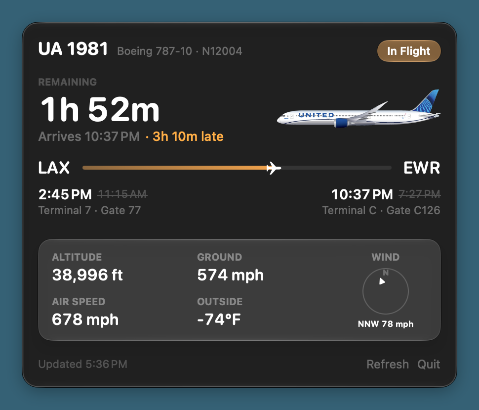

# United Bar

A macOS menu bar app that can track your United flight offline in real-time.
It works by reading local flight information available on the in-flight Wi-Fi
which is free for everyone.

```
✈ LAX → EWR 1h 52m
```

Clicking it opens the panel:



## How it works

When you connect to in-flight Wi-Fi, you're able to go to `unitedwifi.com` and
view live flight information. The data runs on a machine in the plane which we
can poll once a minute:

```
https://www.unitedwifi.com/api/flight/portal/v1/flifo
```

From there it's as simple as parsing some JSON and rendering it nicely!

